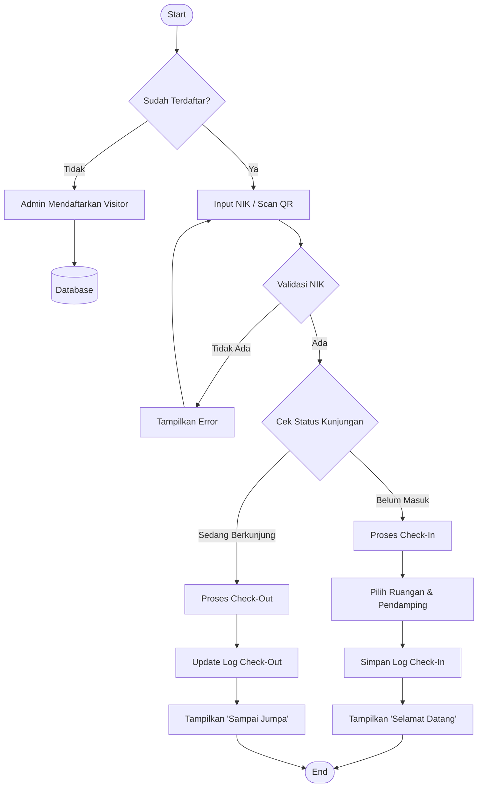
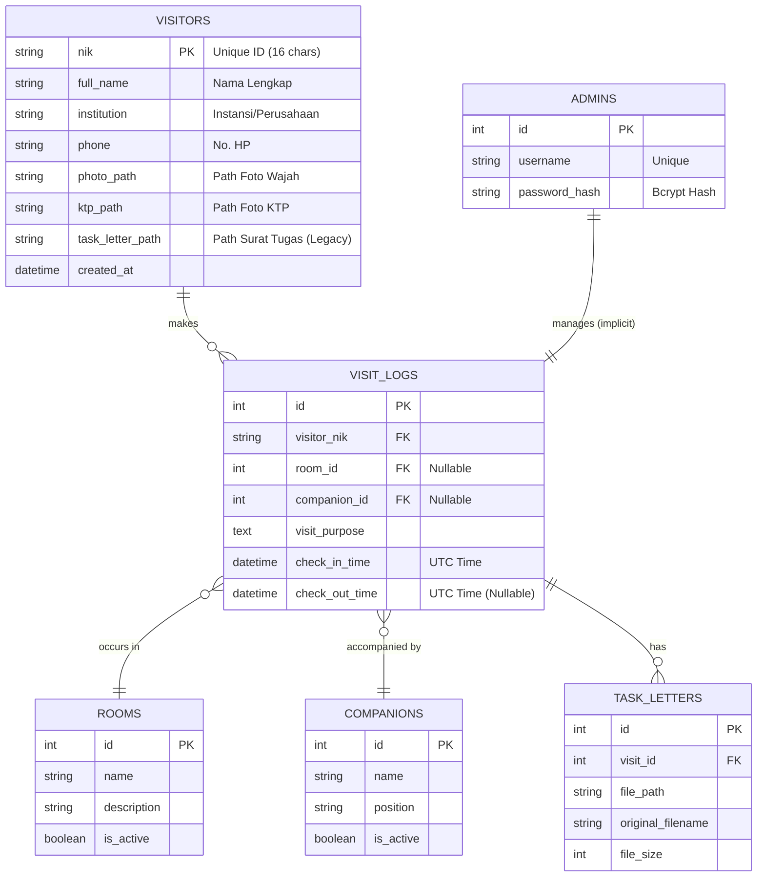

# 📘 Technical Documentation
**Project**: BKN Visitor Management System  
**Generated Date**: January 27, 2026  
**Version**: 2.0.0

---

## 1. 🎭 Use Case Diagram

Diagram ini menggambarkan interaksi antara dua aktor utama (**Visitor** dan **Admin**) dengan sistem.

```mermaid
usecaseDiagram
    actor Visitor
    actor Admin

    package "BKN Visitor System" {
        usecase "Check-In (Scan/NIK)" as UC1
        usecase "Check-Out" as UC2
        usecase "View Visit History" as UC3
        usecase "Manage Visitors (CRUD)" as UC4
        usecase "View Analytics Dashboard" as UC5
        usecase "Export Data (Excel)" as UC6
        usecase "Manual Check-Out" as UC7
        usecase "Register Visitor" as UC8
        usecase "Manage Master Data" as UC9
    }

    Visitor --> UC1
    Visitor --> UC2
    Visitor --> UC3

    Admin --> UC4
    Admin --> UC5
    Admin --> UC6
    Admin --> UC7
    Admin --> UC8
    Admin --> UC9
    Admin --> UC3
```

---

## 2. 🔄 Application Flowchart (Alur Aplikasi)

Alur logika utama aplikasi dari sisi Pengunjung.



---

## 3. ⏱️ Sequence Diagram (Proses Check-In)

Detail interaksi objek saat User melakukan Check-In melalui Frontend.

```mermaid
sequenceDiagram
    participant U as User (Frontend)
    participant A as API (Backend)
    participant D as Database

    U->>A: POST /check-in/ (NIK, RoomID, CompID)
    activate A
    A->>D: Query Visitor by NIK
    activate D
    D-->>A: Return Visitor Data
    deactivate D
    
    vis U U: Validasi Input (16 Digit)

    alt Visitor Not Found
        A-->>U: 404 Not Found
        U->>U: Show "NIK Tidak Terdaftar"
    else Visitor Found
        A->>D: Check Active Visit Logs
        activate D
        D-->>A: Return Active Log
        deactivate D
        
        opt Is Already Checked In?
            A-->>U: 400 Bad Request
            U->>U: Show "Anda Sudah Check-In"
        end

        A->>D: Insert VisitLog (CheckIn Time, Room, Comp)
        activate D
        D-->>A: Confirm Insert
        deactivate D
        
        A-->>U: 200 OK (Success Message)
        U->>U: Redirect to Dashboard (Status: IN)
    end
    deactivate A
```

---

## 4. 🗂️ Entity Relationship Diagram (ERD)

Relasi antar tabel dalam database.



---

## 5. 💾 Struktur Database (Database Schema)

Detail teknis tipe data (mengacu pada SQLAlchemy Models).

### Tabel `visitors`
| Field | Tipe Data | Constraint | Deskripsi |
| :--- | :--- | :--- | :--- |
| `nik` | `VARCHAR(16)` | **PRIMARY KEY** | Nomor Induk Kependudukan (Unik) |
| `full_name` | `VARCHAR` | NOT NULL | Nama Lengkap Pengunjung |
| `institution` | `VARCHAR` | NOT NULL | Asal Instansi |
| `phone` | `VARCHAR` | NULLABLE | Nomor Telepon |
| `photo_path` | `VARCHAR` | NULLABLE | Lokasi file foto profil |
| `ktp_path` | `VARCHAR` | NULLABLE | Lokasi file scan KTP |
| `task_letter_path` | `VARCHAR` | NULLABLE | Legacy (sekarang per visit) |
| `created_at` | `DATETIME` | DEFAULT NOW | Tanggal registrasi |

### Tabel `rooms` (Master Data)
| Field | Tipe Data | Constraint | Deskripsi |
| :--- | :--- | :--- | :--- |
| `id` | `INTEGER` | **PRIMARY KEY**, AI | ID Ruangan |
| `name` | `VARCHAR` | NOT NULL | Nama Ruangan/Gedung |
| `description` | `VARCHAR` | NULLABLE | Deskripsi Ruangan |
| `is_active` | `BOOLEAN` | DEFAULT TRUE | Status Aktif |

### Tabel `companions` (Master Data)
| Field | Tipe Data | Constraint | Deskripsi |
| :--- | :--- | :--- | :--- |
| `id` | `INTEGER` | **PRIMARY KEY**, AI | ID Pendamping |
| `name` | `VARCHAR` | NOT NULL | Nama Pendamping |
| `position` | `VARCHAR` | NULLABLE | Jabatan/Posisi |
| `is_active` | `BOOLEAN` | DEFAULT TRUE | Status Aktif |

### Tabel `visit_logs`
| Field | Tipe Data | Constraint | Deskripsi |
| :--- | :--- | :--- | :--- |
| `id` | `INTEGER` | **PRIMARY KEY**, AI | ID Unik Kunjungan |
| `visitor_nik` | `VARCHAR(16)` | **FOREIGN KEY** | Referensi ke `visitors.nik` |
| `room_id` | `INTEGER` | **FOREIGN KEY** | Referensi ke `rooms.id` |
| `companion_id` | `INTEGER` | **FOREIGN KEY** | Referensi ke `companions.id` |
| `visit_purpose` | `TEXT` | NULLABLE | Tujuan Kunjungan |
| `check_in_time` | `DATETIME` | NOT NULL | Waktu Masuk (disimpan dalam UTC) |
| `check_out_time` | `DATETIME` | NULLABLE | Waktu Keluar (disimpan dalam UTC) |

### Tabel `task_letters`
| Field | Tipe Data | Constraint | Deskripsi |
| :--- | :--- | :--- | :--- |
| `id` | `INTEGER` | **PRIMARY KEY**, AI | ID Surat Tugas |
| `visit_id` | `INTEGER` | **FOREIGN KEY** | ID Kunjungan |
| `file_path` | `VARCHAR` | NOT NULL | Lokasi File |
| `original_filename`| `VARCHAR` | NOT NULL | Nama Asli File |

### Tabel `admins`
| Field | Tipe Data | Constraint | Deskripsi |
| :--- | :--- | :--- | :--- |
| `id` | `INTEGER` | **PRIMARY KEY**, AI | ID Admin |
| `username` | `VARCHAR` | **UNIQUE** | Username Login |
| `password_hash` | `VARCHAR` | NOT NULL | Password terenkripsi (Bcrypt) |

---

## 6. 🎨 UI/UX Design

> **[Refer to Figma for Design System & Guidelines]**
>
> *Bagian ini dikosongkan untuk diisi oleh tim Desain/UI UX sesuai referensi Figma.*
